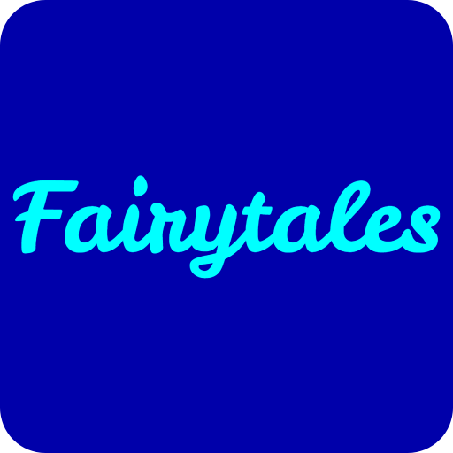
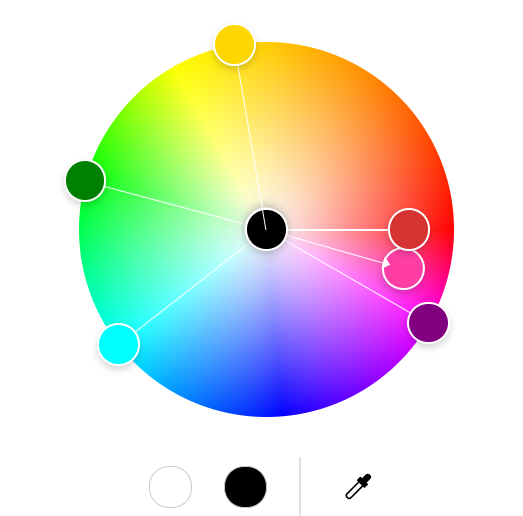
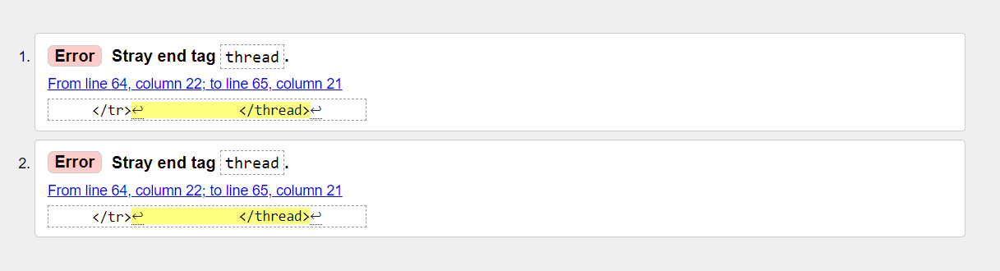
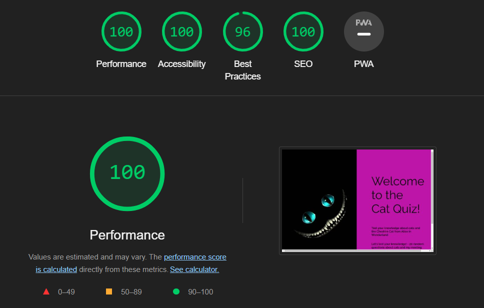
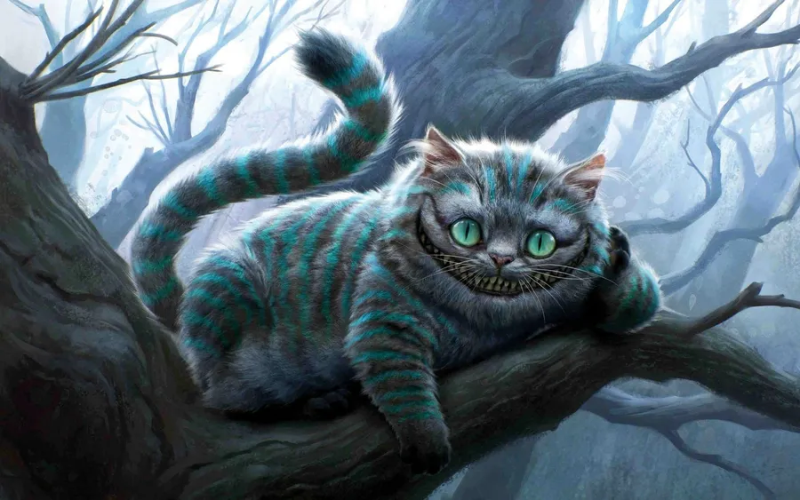

# Quizzing with Cheshire!

<!-- Table of Contents -->
## Table of Contents
* [Project Introduction](#)
* [For First-Time Users:](#)
* [For Returning Users](#)
* [My Process](#)
* [Features](#)
* [art: Color Reference](#) 
* [Usage](#)
* [Roadmap](#)
* [Contributing](#)
* [Questions: FAQ](#)
* [License](#)
* [Contact](#)
* [Background pictures - credits](#)
* [Project Sources](#)
* [Responsive Design and Testing](#)
* [Apology and Explaination Regarding Code Usage](#)

## Project Introduction:

Welcome to "Quizzing with Cheshire" – your gateway to a whimsical adventure blending the enchanting world of Alice in Wonderland with the fascinating realm of cats! Whether you're a first-time visitor or a returning explorer, there's something delightful awaiting you in this cat-tastic quiz experience.

## For First-Time Users:

Are you ready to embark on a journey filled with curiosity, wonder, and, of course, cats? Join us as Cheshire, the mischievous feline from Alice in Wonderland, guides you through a delightful exploration of cat trivia and fairy tale magic. Our quiz is designed to be enjoyable and chill, featuring a couple of light-hearted questions about cats that are perfect for users of all reading ages.

With Cheshire by your side, you'll not only test your knowledge of our furry friends but also discover fascinating tidbits about the whimsical world of Alice in Wonderland. Get ready to immerse yourself in a magical adventure that's sure to leave you smiling and wanting more!

## For Returning Users:

Welcome back, fellow explorer! If you've enjoyed your previous journey with Cheshire, get ready for even more excitement and fun. We're considering adding more questions from the fairy tale and general cat trivia to enhance your quiz experience. Additionally, we're exploring the possibility of developing a leaderboard, where you can compete with other players and showcase your cat knowledge prowess. Stay tuned for these exciting updates as we continue to make "Quizzing with Cheshire" even more purr-fectly delightful!

This project is inspired by my daughter's desire for interactive experiences. Drawing from the whimsical world of Alice in Wonderland, I set out to bring it to life in this project. And let's be real, those cat lovers out there often have conversations with their furry companions, so why not engage in a quiz with Cheshire and his adventures?

## My Process:

I brainstormed questions that would not only be easy but also offer fun facts and memorable takeaways. Realizing the need for variety, I crafted over 20 random questions to curate a dynamic 10-question quiz. To ensure accessibility, I designed it as a multiple-choice experience, suitable for users of all reading levels. And of course, I injected a cheeky fun factor, embodied by our mischievous host, Cheshire.

## Project Features Overview:

This project includes several key features designed to enhance the user experience:

### Introduction Page: 
An inviting introduction page welcomes the user and encourages them to play the game.
### Quiz Section: 
The main section of the game contains 29 questions about cats and the Cheshire Cat from Alice in Wonderland.
### Score Section: 
At the end of the quiz, a score section displays the user's results and includes a leaderboard, which is stored locally using local storage.
### Timer: 
A timer starts running when the user clicks the start button, adding a time-based challenge element to the game.

## To accommodate the content flow, the project is structured into four main sections:

### Introduction to the Quiz: 
Welcomes users and introduces them to Cheshire and the adventure that awaits.
### Quiz Questions: 
Presents users with a series of questions, each with four possible answers, fostering interactive engagement.
### Correct or Incorrect Responses: 
Provides feedback and encouragement based on user answers, along with tracking their score.
### Final Score: 
Displays the user's end score and offers the option to start the quiz anew.
These features work together to create an engaging and interactive quiz experience for the user.

## Color Reference:[Color Palette](https://color.adobe.com/create/color-wheel#) 

The color scheme for this project was chosen to create a bright and cheerful atmosphere, reflecting the whimsical theme of Cheshire the Cat from "Alice in Wonderland." Below are the specific colors used throughout the project:

- **Primary Color**: [#ff3ea5] - A vibrant pink color used for primary elements.
- **Wrong Answer**: [#d63333] - A bold red color indicating incorrect answers.
- **Correct Answer**: [#008000]  - A standard green color indicating correct answers.
- **Font Colors**:
  - **Black**: [#000000]- Used for the main text to ensure readability.
  - **Purple**: [#800080] - Used for paragraph text, adding a whimsical touch in line with the theme.
- **Start Button Border**: [#00ffff] - A bright aqua color used for the border of the start button to make it stand out.
- **Table Borders** (`<th>` and `<td>` elements): [#ffd700] - A gold color used for table borders to add a touch of elegance.
- **Background Color**: [#f5f5f5] - A light, neutral background color that keeps the interface clean and readable.
- **Image Fallback Color**: [#00ffff]- Aqua color used as a fallback if an image fails to load.

These colors were selected not only for their aesthetic appeal but also to maintain consistency with the playful and fantastical theme of the Cheshire Cat.

## Usage:
### How to Play "Quizzing with Cheshire":

1. **Starting the Quiz**:
   - Upon opening the quiz, you will be greeted by an inviting introduction page with Cheshire's warm welcome. Read through the brief introduction and click on the "Start Quiz" button to begin your adventure.

2. **Answering Questions**:
   - The quiz consists of a series of 10 random questions about cats and the Cheshire Cat from Alice in Wonderland.
   - Each question will appear one at a time, accompanied by four possible answers.
   - Click on the answer you believe is correct. The interface will provide immediate feedback, indicating whether your answer was correct or incorrect.

3. **Feedback and Encouragement**:
   - For each question, after selecting an answer, you will see a message indicating if your answer was correct (green) or incorrect (red). 
   - Encouraging messages will be displayed to motivate you to continue, regardless of whether your answer was right or wrong.

4. **Tracking Your Progress**:
   - A progress tracker will display your current question number out of the total 10 questions, helping you keep track of your journey through the quiz.

5. **Timer**:
   - The quiz features a timer that starts as soon as you click the "Start Quiz" button. This adds an element of challenge, encouraging you to think quickly and answer promptly.

6. **Completing the Quiz**:
   - After answering all 10 questions, you will be taken to the final score section. Here, your total score will be displayed, along with feedback based on your performance.
   - The score section also includes a leaderboard feature, where your score will be stored locally, allowing you to see how you rank compared to other players.

7. **Restarting the Quiz**:
   - If you wish to play again, you can click the "Restart Quiz" button. This will reset the quiz, allowing you to start over and attempt to improve your score.

### Tips for a Great Quiz Experience:

- **Read Carefully**: Take your time to read each question and all possible answers thoroughly before making your selection.
- **Stay Calm**: The timer adds a challenge, but staying calm and focused will help you perform better.
- **Learn and Improve**: Use the feedback provided to learn from any mistakes and improve your knowledge for future attempts.
- **Have Fun**: Remember, the primary goal of "Quizzing with Cheshire" is to provide an enjoyable and whimsical experience. Have fun and embrace the magical world of cats and Cheshire!

By following these steps and tips, you will be able to fully enjoy and engage with the "Quizzing with Cheshire" experience, testing your knowledge and having fun along the way.

## Roadmap: Possible extensions/ To do List!

To continuously enhance the "Quizzing with Cheshire" experience, the following roadmap outlines planned developments and potential future features:

1. **Expand Question Bank**:
   - Add more questions to increase the variety and depth of the quiz, covering more aspects of both general cat trivia and "Alice in Wonderland."
   - Implement a categorization feature to allow users to choose specific topics or difficulty levels.

2. **Enhanced User Interaction**:
   - Introduce animated transitions and effects to make the quiz more engaging and visually appealing.
   - Add audio feedback for correct and incorrect answers to enhance the interactive experience.

3. **Leaderboard Improvements**:
   - Develop a more sophisticated leaderboard system that allows users to create profiles and save their scores across multiple sessions.
   - Introduce weekly and monthly leaderboards to encourage repeat participation and competition among users.

4. **Social Sharing Features**:
   - Enable users to share their quiz results on social media platforms directly from the results page.
   - Add social media integration to allow users to challenge their friends and compare scores.

5. **Mobile Optimization**:
   - Further optimize the quiz for mobile devices to ensure a smooth and responsive experience on all screen sizes.
   - Develop a standalone mobile app version of the quiz for both iOS and Android platforms.

6. **Accessibility Enhancements**:
   - Implement features to improve accessibility, such as text-to-speech options, adjustable font sizes, and high-contrast color themes for users with visual impairments.
   - Ensure compliance with the latest web accessibility standards (WCAG) to make the quiz inclusive for all users.

7. **Advanced Analytics**:
   - Introduce analytics to track user engagement, question performance, and overall quiz difficulty.
   - Use data insights to refine question selection, difficulty balancing, and feature development based on user behavior and feedback.

8. **Additional Languages**:
   - Translate the quiz into multiple languages to reach a broader audience.
   - Implement a language selection feature, allowing users to choose their preferred language for the quiz.

By following this roadmap, we aim to create a more engaging, educational, and enjoyable experience for all users, continuously evolving the "Quizzing with Cheshire" project to meet and exceed user expectations.

## Responsive Design and Testing:
I prioritized responsiveness using tools like Lighthouse to ensure a seamless experience across devices. Addressing encountered issues such as upload speed optimization, JavaScript file organization, favicon integration, and refining class names and IDs for clarity were crucial steps in enhancing the project's performance and user experience.

 

 
   Here I adjusted the errors as advised in html W3C. ALso I was told to remove the autor in <meta> so I moved it down to the footer as shown in templates

## Licence:

   Distributed under the no License. See LICENSE.txt for more information.

## Contact:

   linkedin.com/in/katarina-kilian-082169276

## Contribution:

## Picture Credits:

 

  For the background image of Cheshire, I sourced a captivating graphic poster from , credited to **"miami22"**. The image depicts Cheshire lounging on a tree branch, reminiscent of the iconic scene from Alice in Wonderland where he first encounters Alice. It serves as a fitting visual for our cat-themed quiz project, intertwined with moments from the beloved Disney adaptation.

## Project Sources:
I leveraged various resources throughout the development of this Quiz Project:
- Video tutorials on quiz building. 
- Google Fonts for typography choices.
- Color palettes from design playbooks to ensure visual harmony.
- Favicon creation tool from .
- Community forums like  for troubleshooting and code inspiration.
- GPT - Helped write questions and text corrections.

Feel free to explore the whimsical world of Cheshire and embark on this cat-tastic quiz adventure!

[^1]
[^1]: ## Apology and Explanation Regarding Project Code Usage
During the project, I initially used a video provided to me as a source for coding. When I sought assistance to fix parts of the non-functioning code, I was informed that the code was "well-used by students" and could result in a fail for my PP2 project.

Unfortunately, with only three working days left, it was difficult to distance myself from the code I had been using. I attempted to make changes by using var for global usage. Despite working with "overused code," I still learned a lot by adding my own modifications and coding freestyle, even though the base code was pre-written. I deeply apologize for this.

I understand the seriousness of plagiarism and I assure you that I had no intention of compromising my learning achievements or the integrity of the course. I appreciate the guidelines provided by student care and the online information regarding this matter.

I want to clarify that I used the code from a video given to me by a teacher, unaware that it could be considered plagiarism. Despite this, I gained significant learning experience from using the code and watching the video.

With just 48 hours remaining, including working through the night, I have been diligently adding my own pieces to the project in the hope of passing this part of the course. I kindly ask for your understanding. Once I saw how certain parts of the code worked, it became challenging to break away from it. I know I could use 'if' and 'else' statements to achieve similar results. However, after seeing the well-written, easy-to-understand code, it made more sense to use it. Functions, which are fundamental to JavaScript, help create a seamless user interface (UI). Through my mistakes, I realized that JavaScript is more complex than I initially understood from the course content. Ultimately, our goal as students, teachers, and course developers is to deepen our understanding and mastery of the subject.

